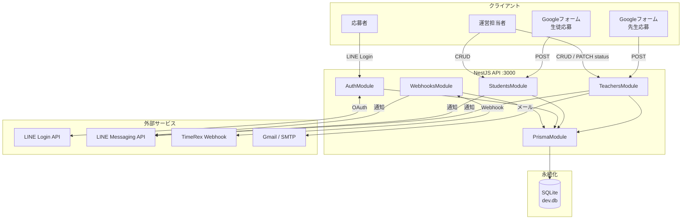
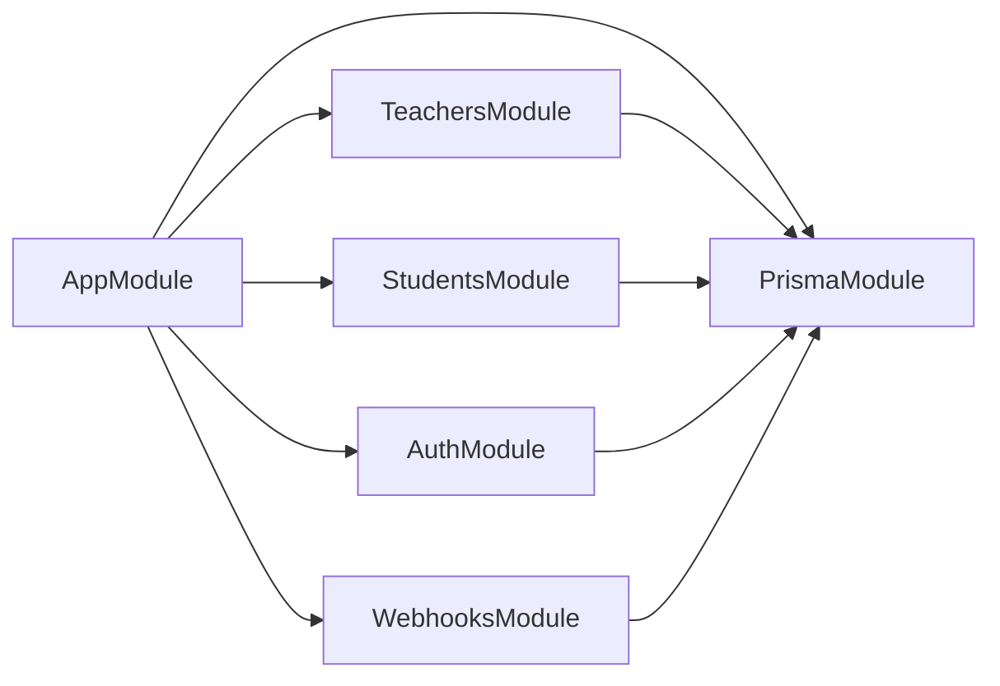
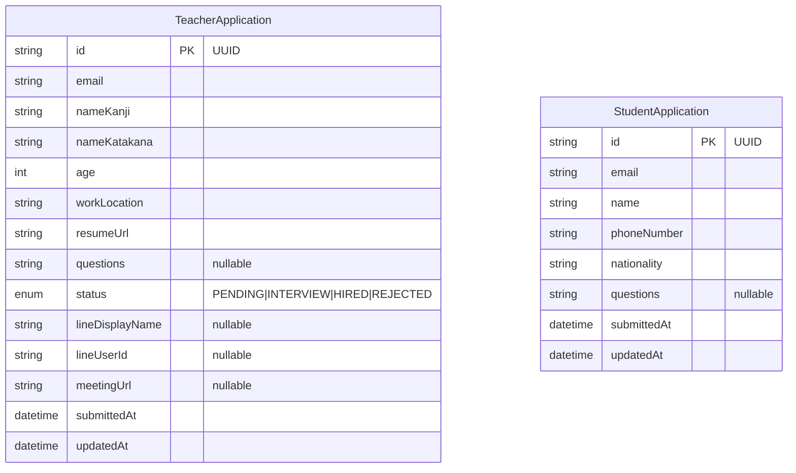
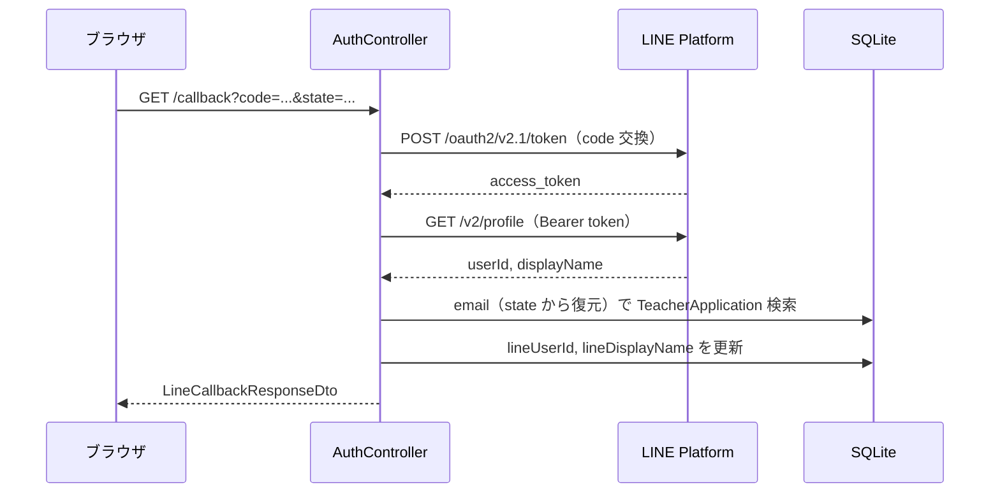
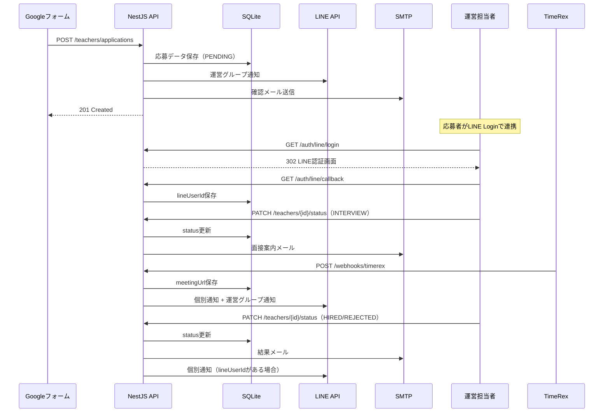
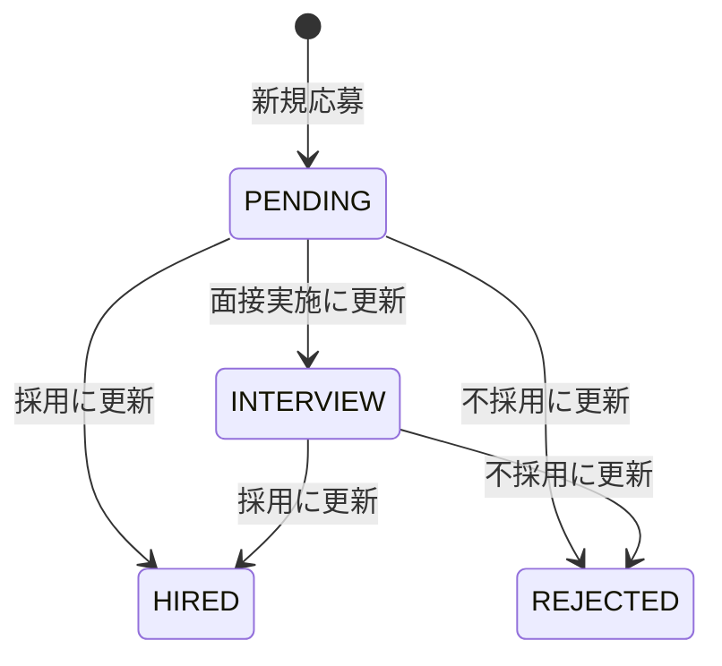

# 塾 応募管理 API 詳細設計書

| 項目 | 内容 |
|------|------|
| ドキュメント名 | 塾 応募管理 API 詳細設計書 |
| バージョン | 1.0 |
| 作成日 | 2026-06-12 |
| 対象システム | `nest-api-project-01`（NestJS 11 REST API） |
| 関連資料 | `api-design-document.json`, `regacy_gas/` |

---

## 目次

1. [概要](#1-概要)
2. [システム構成](#2-システム構成)
3. [アーキテクチャ設計](#3-アーキテクチャ設計)
4. [データベース設計](#4-データベース設計)
5. [API 詳細仕様](#5-api-詳細仕様)
6. [外部連携設計](#6-外部連携設計)
7. [ビジネスロジック・処理フロー](#7-ビジネスロジック処理フロー)
8. [環境変数・設定](#8-環境変数設定)
9. [エラーハンドリング](#9-エラーハンドリング)
10. [セキュリティ設計](#10-セキュリティ設計)
11. [テスト設計](#11-テスト設計)
12. [旧 GAS システムとの対応表](#12-旧-gas-システムとの対応表)
13. [実装状況と残タスク](#13-実装状況と残タスク)

---

## 1. 概要

### 1.1 目的

本システムは、塾の先生・生徒の応募管理を行う REST API である。従来の Google Apps Script（GAS）+ Google スプレッドシート構成から、NestJS + Prisma（SQLite）構成へ移行する。

### 1.2 主要機能

| 機能領域 | 説明 |
|---------|------|
| 先生応募管理 | 新規応募受付、選考ステータス管理、基本情報 CRUD |
| 生徒応募管理 | 新規応募受付、基本情報 CRUD |
| LINE 連携 | LINE Login による応募者との userId 紐づけ |
| 通知 | メール送信、LINE Messaging API（運営グループ・個別） |
| Webhook | TimeRex 面接予約完了通知の受信と後続処理 |

### 1.3 利用者・連携先

| 利用者 / 連携先 | 役割 |
|----------------|------|
| Google フォーム（先生） | 応募データの入力元（将来的に API へ POST） |
| Google フォーム（生徒） | 応募データの入力元 |
| 運営担当者 | Swagger UI または管理画面から応募データの閲覧・ステータス更新 |
| 応募者（先生） | LINE Login でアカウント連携、面接予約（TimeRex） |
| LINE Platform | OAuth 認証、Push メッセージ送信 |
| TimeRex | 面接予約完了 Webhook の送信元 |
| Gmail / SMTP | 確認メール・選考結果メールの送信 |

### 1.4 非機能要件

| 項目 | 方針 |
|------|------|
| フレームワーク | NestJS 11（TypeScript） |
| 永続化 | Prisma 7 + SQLite（libsql アダプター） |
| API 仕様 | OpenAPI 3.0（Swagger UI: `/api`） |
| バリデーション | `class-validator` + グローバル `ValidationPipe` |
| 認証 | 現状なし（管理 API は将来的に認証追加を検討） |
| ポート | デフォルト `3000`（`PORT` 環境変数で変更可） |

---

## 2. システム構成

### 2.1 全体構成図



### 2.2 技術スタック

| レイヤー | 技術 |
|---------|------|
| ランタイム | Node.js 22 |
| フレームワーク | NestJS 11 |
| ORM | Prisma 7（`@prisma/adapter-libsql`） |
| DB | SQLite（`file:./dev.db`） |
| バリデーション | class-validator / class-transformer |
| API ドキュメント | @nestjs/swagger |
| テスト | Jest + supertest |

### 2.3 ディレクトリ構成

```
src/
├── main.ts                    # エントリポイント、Swagger 設定
├── app.module.ts              # ルートモジュール
├── prisma/
│   ├── prisma.module.ts
│   └── prisma.service.ts      # PrismaClient + libsql アダプター
├── teachers/
│   ├── teachers.module.ts
│   ├── teachers.controller.ts
│   ├── teachers.service.ts
│   ├── dto/                   # リクエスト / レスポンス DTO
│   └── enums/
├── students/
│   ├── students.module.ts
│   ├── students.controller.ts
│   ├── students.service.ts
│   └── dto/
├── auth/
│   ├── auth.module.ts
│   ├── auth.controller.ts
│   ├── auth.service.ts
│   └── dto/
└── webhooks/
    ├── webhooks.module.ts
    ├── webhooks.controller.ts
    ├── webhooks.service.ts
    └── dto/
```

---

## 3. アーキテクチャ設計

### 3.1 レイヤー構成

NestJS の標準パターン（Controller / Service / Module / DTO）に従う。

| レイヤー | 責務 |
|---------|------|
| Controller | HTTP リクエスト受付、DTO バリデーション、HTTP ステータスコード返却 |
| Service | ビジネスロジック、DB 操作、外部 API 呼び出し |
| DTO | リクエスト / レスポンスの型定義、Swagger デコレータ、バリデーションルール |
| Module | 依存関係の束ね、DI コンテナ設定 |
| PrismaService | DB アクセスの共通基盤 |

### 3.2 モジュール依存関係



### 3.3 今後追加予定の共通モジュール（設計）

外部連携の本実装に伴い、以下のモジュール追加を推奨する。

| モジュール | 責務 |
|-----------|------|
| `LineModule` | LINE Login OAuth、Messaging API Push |
| `MailModule` | メールテンプレート管理、SMTP / Gmail 送信 |
| `NotificationModule` | 通知テンプレートの組み立て、LINE / メールのオーケストレーション |

---

## 4. データベース設計

### 4.1 ER 図



### 4.2 テーブル定義: TeacherApplication

旧 GAS スプレッドシート「先生応募一覧」に対応する。

| カラム | 型 | NULL | デフォルト | 説明 | 旧スプレッドシート列 |
|--------|-----|------|-----------|------|---------------------|
| `id` | TEXT (UUID) | NO | uuid() | 主キー | — |
| `email` | TEXT | NO | — | メールアドレス | Col 2 |
| `nameKanji` | TEXT | NO | — | お名前（漢字） | Col 3 |
| `nameKatakana` | TEXT | NO | — | お名前（カタカナ） | Col 4 |
| `age` | INTEGER | NO | — | 年齢 | Col 5 |
| `workLocation` | TEXT | NO | — | 勤務希望場所 | Col 6 |
| `resumeUrl` | TEXT | NO | — | 履歴書 URL | Col 8 |
| `questions` | TEXT | YES | — | 質問事項 | Col 7 |
| `status` | TEXT (enum) | NO | `PENDING` | 選考ステータス | Col 9 |
| `lineDisplayName` | TEXT | YES | — | LINE 表示名 | Col 10 |
| `lineUserId` | TEXT | YES | — | LINE userId | Col 11 |
| `meetingUrl` | TEXT | YES | — | 面接 URL | —（TimeRex 連携で追加） |
| `submittedAt` | DATETIME | NO | now() | 応募日時 | Col 1 |
| `updatedAt` | DATETIME | NO | auto | 最終更新日時 | — |

#### 選考ステータス（TeacherApplicationStatus）

| 値 | 旧 GAS 表記 | 説明 |
|----|------------|------|
| `PENDING` | （未選択） | 応募受付直後の初期状態 |
| `INTERVIEW` | 面接実施 | 面接選考中 |
| `HIRED` | 採用 | 採用決定 |
| `REJECTED` | 不採用 | 不採用 |

### 4.3 テーブル定義: StudentApplication

Google フォーム「生徒募集」に対応する（旧 GAS には未実装、本 API で新規追加）。

| カラム | 型 | NULL | デフォルト | 説明 |
|--------|-----|------|-----------|------|
| `id` | TEXT (UUID) | NO | uuid() | 主キー |
| `email` | TEXT | NO | — | メールアドレス |
| `name` | TEXT | NO | — | 氏名 |
| `phoneNumber` | TEXT | NO | — | 電話番号 |
| `nationality` | TEXT | NO | — | 国籍 |
| `questions` | TEXT | YES | — | 質問・相談内容 |
| `submittedAt` | DATETIME | NO | now() | 応募日時 |
| `updatedAt` | DATETIME | NO | auto | 最終更新日時 |

### 4.4 インデックス設計（推奨）

現状インデックスは未定義。以下の追加を推奨する。

| テーブル | カラム | 用途 |
|---------|--------|------|
| `TeacherApplication` | `email` | LINE 連携時のメールアドレス検索（`getRowByMail` 相当） |
| `TeacherApplication` | `status` | ステータス別一覧取得 |
| `StudentApplication` | `email` | メールアドレス検索 |

---

## 5. API 詳細仕様

ベース URL: `http://localhost:3000`（本番は環境に応じて変更）

共通仕様:
- リクエストボディ: `application/json`
- バリデーションエラー: HTTP `400`
- リソース未存在: HTTP `404`
- グローバルパイプ: `whitelist: true`, `transform: true`

---

### API #1: 先生の新規応募

| 項目 | 内容 |
|------|------|
| メソッド / URL | `POST /api/v1/teachers/applications` |
| 旧 GAS 関数 | `onFormSubmit` |
| 実装状況 | DB 保存 ✅ / 通知 ❌ |

#### リクエストボディ（CreateTeacherApplicationDto）

| フィールド | 型 | 必須 | バリデーション | 説明 |
|-----------|-----|------|---------------|------|
| `email` | string | ✅ | `@IsEmail()` | メールアドレス |
| `nameKanji` | string | ✅ | `@IsNotEmpty()` | お名前（漢字） |
| `nameKatakana` | string | ✅ | `@IsNotEmpty()` | お名前（カタカナ） |
| `age` | number | ✅ | `@IsInt()`, 18〜80 | 年齢 |
| `workLocation` | string | ✅ | `@IsNotEmpty()` | 勤務希望場所 |
| `resumeUrl` | string | ✅ | `@IsUrl()` | 履歴書 URL |
| `questions` | string | — | `@IsOptional()` | 質問事項 |

#### レスポンス

- 成功: HTTP `201 Created`
- ボディ: `TeacherApplicationResponseDto`（`status` は `PENDING`）

#### 処理フロー（設計）

1. リクエストをバリデーション
2. `TeacherApplication` レコードを作成（`status = PENDING`）
3. 運営グループへ LINE 通知を送信（テンプレート変数: `[username]`, `[mail]`, `[history]`）
4. 応募者へ確認メールを送信
5. 作成したレコードを返却

#### 旧 GAS との差分

- 旧 GAS ではスプレッドシート行追加 + ドロップダウン（採用/不採用/面接実施）のデータ検証を設定していたが、API では `status` 列の enum で代替

---

### API #2: 先生の選考ステータス更新

| 項目 | 内容 |
|------|------|
| メソッド / URL | `PATCH /api/v1/teachers/applications/{id}/status` |
| 旧 GAS 関数 | `onEditSaiyo`, `execSaiyoProcess`, `execFusaiyoProcess`, `execMensetsuProcess` |
| 実装状況 | DB 更新 ✅ / 通知 ❌ |

#### パスパラメータ

| 名前 | 型 | 説明 |
|------|-----|------|
| `id` | string (UUID) | 先生応募 ID |

#### リクエストボディ（UpdateTeacherStatusDto）

| フィールド | 型 | 必須 | 説明 |
|-----------|-----|------|------|
| `status` | `PENDING` \| `INTERVIEW` \| `HIRED` \| `REJECTED` | ✅ | 新しい選考ステータス |

#### レスポンス

- 成功: HTTP `200 OK`
- ボディ: 更新後の `TeacherApplicationResponseDto`

#### ステータス別の副作用（設計）

| 新ステータス | メール | LINE 個別通知 | テンプレート（旧 GAS「メール本文」シート） |
|-------------|--------|--------------|------------------------------------------|
| `INTERVIEW` | 面接案内メール送信 | なし | Row 8（件名）, Row 9（本文） |
| `HIRED` | 採用通知メール送信 | `lineUserId` があれば送信 | Row 1（件名）, Row 2（本文）, Row 12（LINE） |
| `REJECTED` | 不採用通知メール送信 | `lineUserId` があれば送信 | Row 3（件名）, Row 4（本文）, Row 13（LINE） |
| `PENDING` | なし | なし | — |

#### 旧 GAS との差分

- 旧 GAS ではスプレッドシートのドロップダウン変更時に確認ダイアログ（HTML モーダル）を表示していた。API では確認はクライアント側（運営 UI）の責務とする

---

### API #3: 生徒の新規応募

| 項目 | 内容 |
|------|------|
| メソッド / URL | `POST /api/v1/students/applications` |
| 旧 GAS 関数 | （新規追加） |
| 実装状況 | DB 保存 ✅ / 通知 ❌ |

#### リクエストボディ（CreateStudentApplicationDto）

| フィールド | 型 | 必須 | バリデーション | 説明 |
|-----------|-----|------|---------------|------|
| `email` | string | ✅ | `@IsEmail()` | メールアドレス |
| `name` | string | ✅ | `@IsNotEmpty()` | 氏名 |
| `phoneNumber` | string | ✅ | `@IsNotEmpty()` | 電話番号 |
| `nationality` | string | ✅ | `@IsNotEmpty()` | 国籍 |
| `questions` | string | — | `@IsOptional()` | 質問・相談内容 |

#### レスポンス

- 成功: HTTP `201 Created`
- ボディ: `StudentApplicationResponseDto`

#### 処理フロー（設計）

1. リクエストをバリデーション
2. `StudentApplication` レコードを作成
3. 運営グループへ LINE 通知を送信（テンプレートは新規定義が必要）

---

### API #4: LINE ログイン開始

| 項目 | 内容 |
|------|------|
| メソッド / URL | `GET /api/v1/auth/line/login` |
| 旧 GAS 関数 | `doGet`, `redirectToLineLogin` |
| 実装状況 | **仮実装** |

#### クエリパラメータ（LineLoginQueryDto）

| 名前 | 型 | 必須 | 説明 |
|------|-----|------|------|
| `userType` | `teacher` \| `student` | — | 対象ユーザー種別 |
| `redirectUri` | string | — | コールバック URL（省略時はデフォルト） |

#### レスポンス

- HTTP `302 Found`（LINE 認証画面へリダイレクト）

#### 処理フロー（設計）

1. `state` トークンを生成（CSRF 対策。旧 GAS では `mail` を state に格納）
2. 以下の URL を組み立ててリダイレクト:

```
https://access.line.me/oauth2/v2.1/authorize
  ?response_type=code
  &client_id={LINE_CHANNEL_ID}
  &redirect_uri={LINE_REDIRECT_URI}
  &scope=openid%20profile
  &state={state}
```

3. 旧 GAS では HTML ボタン経由で `window.top.location.href` に遷移していた。API では `@Redirect()` デコレータで直接リダイレクト

---

### API #5: LINE コールバック処理

| 項目 | 内容 |
|------|------|
| メソッド / URL | `GET /api/v1/auth/line/callback` |
| 旧 GAS 関数 | `handleCallback`, `getToken`, `getUserProfile`, `saveUserToSheet` |
| 実装状況 | **仮実装** |

#### クエリパラメータ（LineCallbackQueryDto）

| 名前 | 型 | 必須 | 説明 |
|------|-----|------|------|
| `code` | string | ✅ | LINE 認可コード |
| `state` | string | ✅ | CSRF トークン（旧 GAS ではメールアドレスを格納） |

#### レスポンス

- 成功: HTTP `200 OK`
- ボディ: `LineCallbackResponseDto`

```json
{
  "message": "LINE連携が完了しました。",
  "userId": "a1b2c3d4-...",
  "lineUserId": "Uxxxxxxxxxxxxxxxxx",
  "lineDisplayName": "山田 太郎"
}
```

#### 処理フロー（設計）



#### エラーケース

| 条件 | HTTP ステータス |
|------|----------------|
| 認可コード不正 / 期限切れ | `400` |
| state のメールアドレスに一致する応募者なし | `404` |

---

### API #6: TimeRex 面接予約完了通知

| 項目 | 内容 |
|------|------|
| メソッド / URL | `POST /api/v1/webhooks/timerex` |
| 旧 GAS 関数 | `doPost` |
| 実装状況 | **仮実装** |

#### リクエストボディ（TimerexWebhookDto）

| フィールド | 型 | 必須 | 説明 |
|-----------|-----|------|------|
| `reservationId` | string | ✅ | TimeRex 予約 ID |
| `calendarTitle` | string | ✅ | カレンダー名 |
| `scheduledStartAt` | string (ISO8601) | ✅ | 面接開始日時 |
| `scheduledEndAt` | string (ISO8601) | ✅ | 面接終了日時 |
| `meetingUrl` | string | ✅ | Google Meet 等の URL |
| `guestName` | string | ✅ | 予約者氏名 |
| `guestEmail` | string | ✅ | 予約者メールアドレス |
| `notes` | string | — | 備考 |

> **注意**: 旧 GAS の `doPost` は `guest_email`, `join_url` というフィールド名を使用している。TimeRex の実際の Webhook ペイロード形式に合わせてマッピング層の追加が必要な場合がある。

#### レスポンス

- 成功: HTTP `200 OK`
- ボディ: `TimerexWebhookResponseDto`

#### 処理フロー（設計）

1. Webhook ペイロードをバリデーション
2. `guestEmail` で `TeacherApplication` を検索
3. 見つかった場合、`meetingUrl` を DB に保存
4. `lineUserId` があれば応募者へ個別 LINE 通知
5. 運営グループへ予約完了 LINE 通知
6. レスポンスを返却

#### 旧 GAS との差分

- 旧 GAS では別スプレッドシート（TimeRex 用）にも行を追加していた。本 API では `TeacherApplication.meetingUrl` への保存で代替（必要に応じて予約履歴テーブルを追加検討）

---

### API #7: 先生の応募データ一覧取得

| 項目 | 内容 |
|------|------|
| メソッド / URL | `GET /api/v1/teachers/applications` |
| 旧 GAS 関数 | スプレッドシート直接閲覧 |
| 実装状況 | ✅ 完了 |

#### レスポンス

- 成功: HTTP `200 OK`
- ボディ: `TeacherApplicationResponseDto[]`（`submittedAt` 降順）

---

### API #13: 先生の応募データ詳細取得

| 項目 | 内容 |
|------|------|
| メソッド / URL | `GET /api/v1/teachers/applications/{id}` |
| 旧 GAS 関数 | スプレッドシートの行閲覧（管理画面 ADM-05 向け） |
| 実装状況 | ✅ 完了 |

#### パスパラメータ

| 名前 | 型 | 必須 | 説明 |
|------|-----|------|------|
| `id` | string (UUID) | ✅ | 先生応募 ID |

#### レスポンス

- 成功: HTTP `200 OK`
- ボディ: `TeacherApplicationResponseDto`
- 失敗: HTTP `404 Not Found`（指定 ID のレコードが存在しない）

---

### API #8: 先生の基本情報更新

| 項目 | 内容 |
|------|------|
| メソッド / URL | `PUT /api/v1/teachers/applications/{id}` |
| 旧 GAS 関数 | スプレッドシートのセル直接編集 |
| 実装状況 | ✅ 完了 |

#### リクエストボディ（UpdateTeacherApplicationDto）

| フィールド | 型 | 必須 | 説明 |
|-----------|-----|------|------|
| `nameKanji` | string | ✅ | お名前（漢字） |
| `nameKatakana` | string | ✅ | お名前（カタカナ） |
| `age` | number | ✅ | 年齢（18〜80） |
| `workLocation` | string | ✅ | 勤務希望場所 |
| `resumeUrl` | string | ✅ | 履歴書 URL |
| `questions` | string | — | 質問事項 |

---

### API #9: 先生の応募データ削除

| 項目 | 内容 |
|------|------|
| メソッド / URL | `DELETE /api/v1/teachers/applications/{id}` |
| 旧 GAS 関数 | スプレッドシートの行削除 |
| 実装状況 | ✅ 完了 |

#### レスポンス

- 成功: HTTP `204 No Content`（ボディなし）

---

### API #10: 生徒の応募データ一覧取得

| 項目 | 内容 |
|------|------|
| メソッド / URL | `GET /api/v1/students/applications` |
| 実装状況 | ✅ 完了 |

#### レスポンス

- 成功: HTTP `200 OK`
- ボディ: `StudentApplicationResponseDto[]`（`submittedAt` 降順）

---

### API #14: 生徒の応募データ詳細取得

| 項目 | 内容 |
|------|------|
| メソッド / URL | `GET /api/v1/students/applications/{id}` |
| 旧 GAS 関数 | （新規・管理画面 ADM-08 向け） |
| 実装状況 | ✅ 完了 |

#### パスパラメータ

| 名前 | 型 | 必須 | 説明 |
|------|-----|------|------|
| `id` | string (UUID) | ✅ | 生徒応募 ID |

#### レスポンス

- 成功: HTTP `200 OK`
- ボディ: `StudentApplicationResponseDto`
- 失敗: HTTP `404 Not Found`（指定 ID のレコードが存在しない）

---

### API #11: 生徒の基本情報更新

| 項目 | 内容 |
|------|------|
| メソッド / URL | `PUT /api/v1/students/applications/{id}` |
| 実装状況 | ✅ 完了 |

#### リクエストボディ（UpdateStudentApplicationDto）

| フィールド | 型 | 必須 | 説明 |
|-----------|-----|------|------|
| `name` | string | ✅ | 氏名 |
| `phoneNumber` | string | ✅ | 電話番号 |
| `nationality` | string | ✅ | 国籍 |
| `questions` | string | — | 質問・相談内容 |

---

### API #12: 生徒の応募データ削除

| 項目 | 内容 |
|------|------|
| メソッド / URL | `DELETE /api/v1/students/applications/{id}` |
| 実装状況 | ✅ 完了 |

#### レスポンス

- 成功: HTTP `204 No Content`（ボディなし）

---

## 6. 外部連携設計

### 6.1 LINE Login（OAuth 2.0）

| 項目 | 内容 |
|------|------|
| 認可エンドポイント | `https://access.line.me/oauth2/v2.1/authorize` |
| トークンエンドポイント | `https://api.line.me/oauth2/v2.1/token` |
| プロフィール API | `https://api.line.me/v2/profile` |
| スコープ | `openid profile` |
| grant_type | `authorization_code` |

#### state パラメータ設計

旧 GAS では `state` にメールアドレスを格納していた。本 API では以下のいずれかを採用する。

| 方式 | メリット | デメリット |
|------|---------|-----------|
| A. メールアドレスを state に格納（旧 GAS 互換） | 実装が単純 | メールアドレスが URL に露出 |
| B. ランダムトークン + サーバー側セッション / Redis | セキュア | インフラ追加が必要 |
| C. JWT 署名付き state | ステートレス、セキュア | 実装コスト中 |

**推奨**: 初期実装は方式 A（旧 GAS 互換）、本番移行時に方式 C へ移行。

### 6.2 LINE Messaging API

| 項目 | 内容 |
|------|------|
| エンドポイント | `POST https://api.line.me/v2/bot/message/push` |
| 認証 | `Authorization: Bearer {LINE_CHANNEL_ACCESS_TOKEN}` |

#### 通知種別

| 種別 | 送信先 | トリガー |
|------|--------|---------|
| 運営グループ通知 | `LINE_GROUP_ID` | 先生応募受付、生徒応募受付、面接予約完了 |
| 個別通知 | 応募者の `lineUserId` | 採用 / 不採用、面接 URL 通知 |

#### メッセージペイロード例

```json
{
  "to": "Uxxxxxxxxxxxxxxxxx",
  "messages": [
    { "type": "text", "text": "通知メッセージ本文" }
  ]
}
```

### 6.3 メール送信

旧 GAS では `GmailApp.sendEmail` と「メール本文」スプレッドシートのテンプレートを使用していた。

#### テンプレート一覧（旧 GAS「メール本文」シート対応）

| 用途 | シート行（件名 / 本文） | 置換変数 |
|------|----------------------|---------|
| 採用通知 | Row 1 / Row 2 | — |
| 不採用通知 | Row 3 / Row 4 | — |
| 運営グループ LINE | Row 7 | `[username]`, `[mail]`, `[history]` |
| 面接案内メール | Row 8 / Row 9 | `[mail]` |
| 応募確認メール | Row 10 / Row 11 | `[mail]` |
| 採用 LINE 個別 | Row 12 | — |
| 不採用 LINE 個別 | Row 13 | — |

#### 実装方針

- NestJS では `@nestjs-modules/mailer` または `nodemailer` を使用
- テンプレートは環境変数 / 設定ファイル / DB で管理（スプレッドシート依存を排除）
- 開発環境ではメール送信をモックまたはログ出力に切り替え可能にする

### 6.4 TimeRex Webhook

| 項目 | 内容 |
|------|------|
| 受信 URL | `POST /api/v1/webhooks/timerex` |
| 認証 | 現状なし（本番では署名検証の追加を推奨） |

#### 旧 GAS ペイロードとのマッピング

| 旧 GAS フィールド | 本 API フィールド |
|------------------|------------------|
| `guest_email` | `guestEmail` |
| `join_url` | `meetingUrl` |

---

## 7. ビジネスロジック・処理フロー

### 7.1 先生応募〜選考の全体フロー



### 7.2 ステータス遷移図



> 現状の実装では任意のステータス間遷移を許可している。必要に応じて遷移制約を Service 層に追加する。

---

## 8. 環境変数・設定

### 8.1 必須環境変数（本番）

| 変数名 | 説明 | 例 |
|--------|------|-----|
| `DATABASE_URL` | DB 接続文字列 | `file:./dev.db` |
| `LINE_CHANNEL_ID` | LINE Login チャネル ID | `2008552381` |
| `LINE_CHANNEL_SECRET` | LINE Login チャネルシークレット | `***` |
| `LINE_CHANNEL_ACCESS_TOKEN` | Messaging API アクセストークン | `***` |
| `LINE_GROUP_ID` | 運営グループの userId / groupId | `Cxxxxxxxxxx` |
| `LINE_REDIRECT_URI` | OAuth コールバック URL | `https://api.example.com/api/v1/auth/line/callback` |

### 8.2 メール関連（本番）

| 変数名 | 説明 | 例 |
|--------|------|-----|
| `MAIL_HOST` | SMTP ホスト | `smtp.gmail.com` |
| `MAIL_PORT` | SMTP ポート | `587` |
| `MAIL_USER` | 送信元アカウント | `noreply@example.com` |
| `MAIL_PASSWORD` | SMTP パスワード / アプリパスワード | `***` |
| `MAIL_FROM` | From ヘッダー | `塾応募管理 <noreply@example.com>` |

### 8.3 開発環境

開発環境では `DATABASE_URL` を省略可能。`PrismaService` が `file:./dev.db` をデフォルト使用する。`dev.db` はリポジトリにコミット済み。

```bash
# Prisma CLI 使用時のみ必要
export DATABASE_URL=file:./dev.db
npx prisma migrate status
```

---

## 9. エラーハンドリング

### 9.1 HTTP ステータスコード一覧

| コード | 用途 | 発生箇所 |
|--------|------|---------|
| `200` | 正常（取得・更新） | GET, PUT, PATCH |
| `201` | 正常（作成） | POST |
| `204` | 正常（削除） | DELETE |
| `302` | リダイレクト | LINE Login |
| `400` | バリデーションエラー、認可コード不正 | ValidationPipe, Auth |
| `404` | リソース未存在 | Service（`NotFoundException`） |
| `500` | サーバー内部エラー | 未処理例外 |

### 9.2 エラーレスポンス形式

NestJS デフォルトの例外フィルターに従う。

```json
{
  "statusCode": 404,
  "message": "TeacherApplication id=xxx not found",
  "error": "Not Found"
}
```

### 9.3 外部 API 障害時の方針（設計）

| 方針 | 説明 |
|------|------|
| DB 操作優先 | 通知失敗時も DB 操作はロールバックしない（旧 GAS と同様） |
| ログ記録 | 通知失敗は `Logger` でエラーログを出力 |
| リトライ | LINE / メール送信は最大 3 回リトライ（指数バックオフ）を検討 |

---

## 10. セキュリティ設計

### 10.1 現状

| 項目 | 状態 |
|------|------|
| API 認証 | 未実装（全エンドポイントがオープン） |
| CORS | デフォルト設定 |
| Webhook 署名検証 | 未実装 |
| レート制限 | 未実装 |

### 10.2 本番移行時の推奨事項

| 項目 | 推奨 |
|------|------|
| 管理 API 認証 | API Key または JWT による認証を `TeachersController` / `StudentsController` に追加 |
| Webhook 検証 | TimeRex の署名ヘッダー検証を `WebhooksController` に追加 |
| HTTPS | リバースプロキシ（nginx 等）で TLS 終端 |
| シークレット管理 | 環境変数または Secret Manager で管理（コードにハードコードしない） |
| LINE state | CSRF 対策として署名付き state の導入 |

> **注意**: 旧 GAS コード（`regacy_gas/`）にはアクセストークン等のシークレットがハードコードされている。本番では必ず環境変数へ移行すること。

---

## 11. テスト設計

### 11.1 現状

| テスト種別 | ファイル | 状態 |
|-----------|---------|------|
| E2E | `test/app.e2e-spec.ts` | `GET /` のみ（1 件パス） |
| Unit | `src/**/*.spec.ts` | 5 件パス / 4 件失敗 |

#### 既知の失敗原因

`TeachersService`, `StudentsService`, `AuthService`, `WebhooksService` のユニットテストで `PrismaService` が `TestingModule` に提供されていない。

### 11.2 推奨テスト計画

#### E2E テスト（優先度高）

| テストケース | 対象 API |
|-------------|---------|
| 先生応募の作成・一覧・詳細・更新・削除 | API #1, #7, #13, #8, #9 |
| ステータス更新と 404 | API #2 |
| 生徒応募の CRUD + 詳細取得 | API #3, #10, #14, #11, #12 |
| バリデーションエラー（400） | 各 POST / PUT |

#### ユニットテスト

| テストケース | 対象 |
|-------------|------|
| PrismaService のモック注入 | 全 Service spec の修正 |
| ステータス別通知ロジック | TeachersService.updateStatus |
| LINE OAuth URL 生成 | AuthService.getLineLoginUrl |
| TimeRex Webhook 処理 | WebhooksService.receiveTimerex |

#### 外部連携テスト

| テストケース | 方針 |
|-------------|------|
| LINE / メール送信 | モック（`jest.mock`）で副作用を検証 |
| TimeRex Webhook | supertest でペイロード送信 |

---

## 12. 旧 GAS システムとの対応表

### 12.1 API ↔ GAS 関数

| # | API | 旧 GAS 関数 / 処理 | 移行状態 |
|---|-----|-------------------|---------|
| 1 | POST teachers/applications | `onFormSubmit` | DB ✅ 通知 ❌ |
| 2 | PATCH teachers/{id}/status | `onEditSaiyo` + `exec*Process` | DB ✅ 通知 ❌ |
| 3 | POST students/applications | （新規） | DB ✅ 通知 ❌ |
| 4 | GET auth/line/login | `redirectToLineLogin` | 仮実装 |
| 5 | GET auth/line/callback | `handleCallback` | 仮実装 |
| 6 | POST webhooks/timerex | `doPost` | 仮実装 |
| 7 | GET teachers/applications | スプレッドシート閲覧 | ✅ |
| 13 | GET teachers/applications/{id} | 行閲覧（詳細） | ✅ |
| 8 | PUT teachers/{id} | セル直接編集 | ✅ |
| 9 | DELETE teachers/{id} | 行削除 | ✅ |
| 10 | GET students/applications | （新規） | ✅ |
| 14 | GET students/applications/{id} | （新規・詳細） | ✅ |
| 11 | PUT students/{id} | （新規） | ✅ |
| 12 | DELETE students/{id} | （新規） | ✅ |

### 12.2 データ移行

| 旧データソース | 新テーブル | 備考 |
|--------------|-----------|------|
| スプレッドシート「先生応募一覧」 | `TeacherApplication` | 列マッピングは DTO コメント参照 |
| スプレッドシート「メール本文」 | 設定ファイル / DB | テンプレート管理方式を変更 |
| TimeRex 用スプレッドシート | `TeacherApplication.meetingUrl` | 予約履歴が必要なら別テーブル検討 |

### 12.3 廃止される GAS 機能

| 機能 | 理由 |
|------|------|
| スプレッドシートのドロップダウン + 条件付き書式 | API の enum + クライアント UI で代替 |
| 確認ダイアログ（HTML モーダル） | クライアント側の責務 |
| `GmailApp.sendEmail` | SMTP / nodemailer で代替 |
| `SpreadsheetApp` 操作全般 | Prisma CRUD で代替 |

---

## 13. 実装状況と残タスク

### 13.1 実装状況サマリー

| カテゴリ | 進捗 | 詳細 |
|---------|------|------|
| プロジェクト基盤 | 100% | NestJS, Prisma, SQLite, Swagger |
| API インターフェース | 100% | 全 14 エンドポイント定義済み |
| DB スキーマ | 100% | マイグレーション適用済み |
| CRUD ロジック | 100% | 先生・生徒の CRUD + 詳細取得完了 |
| LINE OAuth | 10% | エンドポイントのみ（仮実装） |
| TimeRex Webhook | 10% | 受信のみ（仮実装） |
| メール送信 | 0% | 未実装 |
| LINE Messaging | 0% | 未実装 |
| テスト | 進行中 | 詳細取得 API の E2E / ユニットテスト追加 |

### 13.2 残タスク（優先度順）

#### Phase 1: 外部連携モジュール基盤

- [ ] `LineModule` 作成（OAuth + Messaging API クライアント）
- [ ] `MailModule` 作成（テンプレート管理 + 送信）
- [ ] 環境変数の定義と `.env.example` 作成
- [ ] 旧 GAS「メール本文」シートのテンプレートを設定ファイルへ移行

#### Phase 2: 通知ロジック実装

- [ ] API #1: 先生応募時の LINE グループ通知 + 確認メール
- [ ] API #2: ステータス別メール / LINE 個別通知
- [ ] API #3: 生徒応募時の運営グループ通知
- [ ] API #6: TimeRex Webhook → meetingUrl 保存 + 通知

#### Phase 3: LINE 認証本実装

- [ ] API #4: LINE Login URL 生成（環境変数ベース）
- [ ] API #5: トークン交換 → プロフィール取得 → DB 紐づけ
- [ ] state パラメータのセキュリティ強化

#### Phase 4: 品質向上

- [ ] ユニットテストの PrismaService モック修正
- [ ] E2E テストの API カバレッジ拡充
- [ ] `email` カラムへのインデックス追加
- [ ] 管理 API の認証追加
- [ ] TimeRex Webhook 署名検証

#### Phase 5: 運用

- [ ] 本番 DB（PostgreSQL / Turso 等）への移行検討
- [ ] CI/CD パイプライン構築
- [ ] 旧スプレッドシートからのデータ移行スクリプト

---

## 付録

### A. Swagger UI

開発サーバー起動後、以下で API ドキュメントを閲覧できる。

```
http://localhost:3000/api
```

### B. 関連ファイル

| ファイル | 説明 |
|---------|------|
| `api-design-document.json` | OpenAPI 3.0 仕様（自動生成元） |
| `prisma/schema.prisma` | DB スキーマ定義 |
| `regacy_gas/main.js` | 旧 GAS メインロジック |
| `regacy_gas/line.link.js` | 旧 LINE Login 処理 |
| `regacy_gas/line.admin.js` | 旧 LINE グループ通知 |
| `AGENTS.md` | Cursor Cloud 開発環境セットアップ手順 |

### C. 改訂履歴

| バージョン | 日付 | 変更内容 |
|-----------|------|---------|
| 1.0 | 2026-06-12 | 初版作成 |
| 1.1 | 2026-06-14 | API #13（先生詳細取得）・API #14（生徒詳細取得）を追加 |
