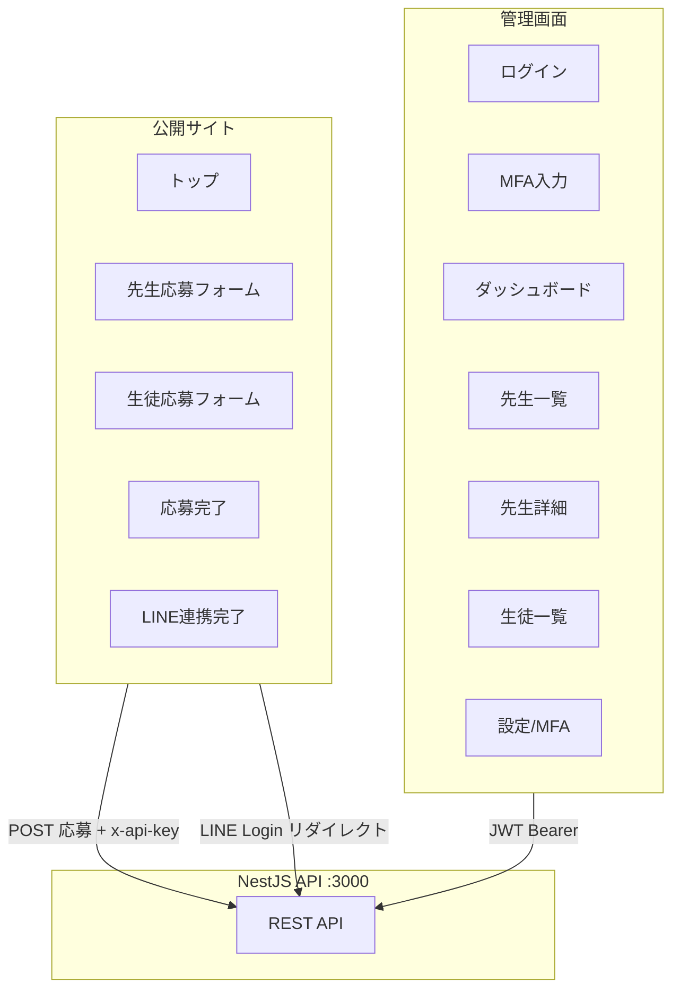
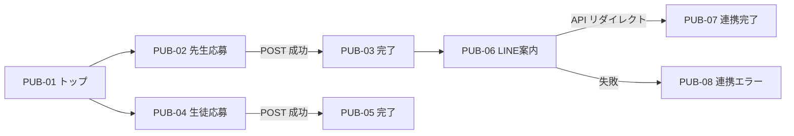
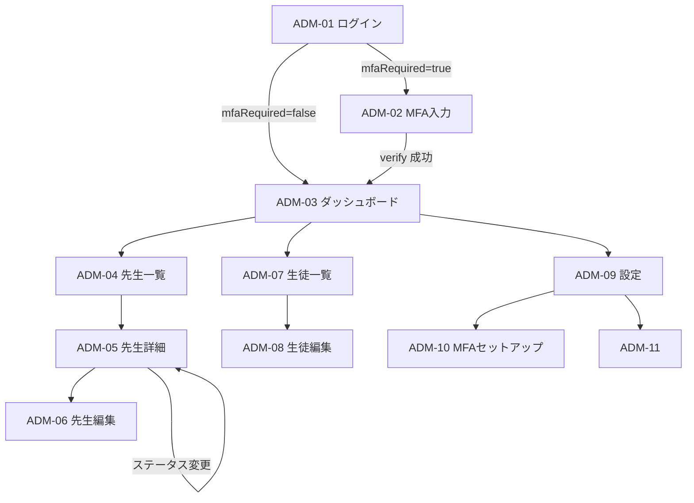
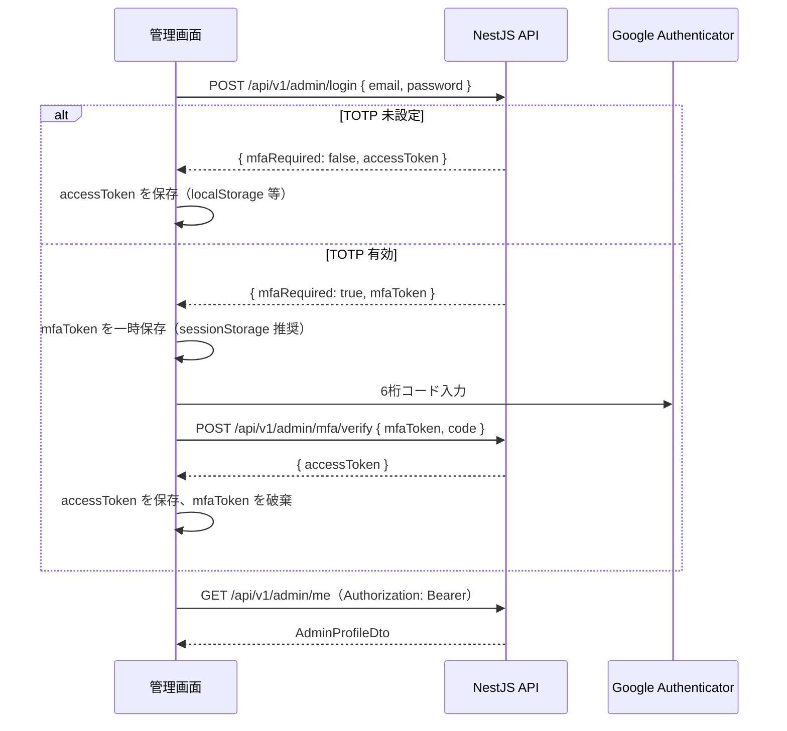

# 塾 応募管理 画面設計書

| 項目 | 内容 |
|------|------|
| ドキュメント名 | 塾 応募管理 画面設計書 |
| バージョン | 1.0 |
| 作成日 | 2026-06-12 |
| 対象システム | `nest-api-project-01` フロントエンド（新規） |
| 関連資料 | `docs/detailed-design.md`, Swagger UI (`/api`) |

---

## 目次

1. [概要・前提](#1-概要前提)
2. [アプリケーション構成](#2-アプリケーション構成)
3. [画面一覧](#3-画面一覧)
4. [画面遷移図](#4-画面遷移図)
5. [認証設計](#5-認証設計)
6. [公開サイト（応募フォーム）](#6-公開サイト応募フォーム)
7. [管理画面](#7-管理画面)
8. [API 対応表](#8-api-対応表)
9. [共通 UI 仕様](#9-共通-ui-仕様)
10. [API ギャップ・実装順序](#10-api-ギャップ実装順序)

---

## 1. 概要・前提

### 1.1 目的

本ドキュメントは、既存 REST API に対応するフロントエンド画面の設計を定義する。バックエンド API 詳細は `docs/detailed-design.md` を正とする。

### 1.2 設計上の前提（確定事項）

| 項目 | 方針 |
|------|------|
| 応募フォーム | **自前 Web フォーム**（Google フォームは廃止） |
| 管理画面 | **公開サイトと分離した別アプリ**（別ドメインまたは別サブドメイン） |
| 管理者認証 | 実装済みの **JWT ログイン + TOTP（Google Authenticator）** を使用 |
| 先生応募詳細 | **専用詳細ページ**を用意（一覧から遷移） |
| 応募者の LINE 連携 | 既存 `GET /api/v1/auth/line/*` を利用 |

### 1.3 利用者

| 利用者 | アプリ | 主な操作 |
|--------|--------|----------|
| 先生（応募者） | 公開サイト | 応募フォーム送信、LINE 連携 |
| 生徒（応募者） | 公開サイト | 応募フォーム送信 |
| 運営担当者 | 管理画面 | ログイン、応募閲覧・編集、選考ステータス更新、MFA 設定 |

---

## 2. アプリケーション構成

### 2.1 2 アプリ構成



### 2.2 推奨 URL・デプロイ

| アプリ | 推奨 URL 例 | CORS 設定 |
|--------|-------------|-----------|
| 公開サイト | `https://www.example.com` | `CORS_ORIGINS` に追加 |
| 管理画面 | `https://admin.example.com` | `CORS_ORIGINS` に追加 |
| API | `https://api.example.com` | — |

フロントエンド実装時は、環境変数で API ベース URL を切り替える。

```
# 公開サイト .env
NEXT_PUBLIC_API_BASE_URL=https://api.example.com
NEXT_PUBLIC_APPLICATION_API_KEY=...   # APPLICATION_API_KEY と同値

# 管理画面 .env
VITE_API_BASE_URL=https://api.example.com
```

---

## 3. 画面一覧

### 3.1 公開サイト

| ID | 画面名 | パス（例） | 認証 |
|----|--------|-----------|------|
| PUB-01 | トップ | `/` | 不要 |
| PUB-02 | 先生応募フォーム | `/apply/teacher` | 不要 |
| PUB-03 | 先生応募完了 | `/apply/teacher/complete` | 不要 |
| PUB-04 | 生徒応募フォーム | `/apply/student` | 不要 |
| PUB-05 | 生徒応募完了 | `/apply/student/complete` | 不要 |
| PUB-06 | LINE 連携案内 | `/line-link` | 不要 |
| PUB-07 | LINE 連携完了 | `/line-link/complete` | 不要 |
| PUB-08 | LINE 連携エラー | `/line-link/error` | 不要 |

### 3.2 管理画面

| ID | 画面名 | パス（例） | 認証 |
|----|--------|-----------|------|
| ADM-01 | ログイン | `/login` | 不要 |
| ADM-02 | MFA 入力（ログイン第2段階） | `/login/mfa` | mfaToken（セッション保持） |
| ADM-03 | ダッシュボード | `/` | JWT 必須 |
| ADM-04 | 先生応募一覧 | `/teachers` | JWT 必須 |
| ADM-05 | 先生応募詳細 | `/teachers/:id` | JWT 必須 |
| ADM-06 | 先生応募編集 | `/teachers/:id/edit` | JWT 必須 |
| ADM-07 | 生徒応募一覧 | `/students` | JWT 必須 |
| ADM-08 | 生徒応募編集 | `/students/:id/edit` | JWT 必須 |
| ADM-09 | アカウント設定 | `/settings` | JWT 必須 |
| ADM-10 | MFA セットアップ | `/settings/mfa/setup` | JWT 必須 |
| ADM-11 | MFA 無効化 | `/settings/mfa/disable` | JWT 必須 |

---

## 4. 画面遷移図

### 4.1 公開サイト



### 4.2 管理画面



---

## 5. 認証設計

### 5.1 管理者認証フロー（実装済み API 準拠）

管理画面は `src/admin/` の JWT + TOTP 認証をそのまま利用する。



#### トークン保管方針

| トークン | 保管先 | 有効期限 | 備考 |
|----------|--------|----------|------|
| `accessToken` | `localStorage` または HttpOnly Cookie | デフォルト 28800 秒 | 管理 API 全般に使用 |
| `mfaToken` | `sessionStorage` | デフォルト 300 秒 | MFA 画面でのみ使用。完了後に削除 |

#### 認証ガード（フロントエンド）

| 条件 | 遷移先 |
|------|--------|
| 保護ルートに `accessToken` なし | `/login` |
| API が `401` を返却 | トークン削除 → `/login` |
| `mfaToken` 期限切れ（MFA 画面） | エラー表示 → `/login` |

### 5.2 管理 API 呼び出し時のヘッダー

```
Authorization: Bearer <accessToken>
Content-Type: application/json
```

### 5.3 応募フォームの認証（API キー）

`APPLICATION_API_KEY` が設定されている場合、公開フォームからの POST に以下を付与する。

```
x-api-key: <APPLICATION_API_KEY>
```

未設定の場合はヘッダー不要（開発環境向け）。

### 5.4 MFA セットアップ・無効化（設定画面）

| 操作 | API | 画面 |
|------|-----|------|
| QR コード取得 | `POST /api/v1/admin/mfa/setup` | ADM-10 |
| TOTP 有効化 | `POST /api/v1/admin/mfa/enable` | ADM-10 |
| TOTP 無効化 | `POST /api/v1/admin/mfa/disable` | ADM-11 |

---

## 6. 公開サイト（応募フォーム）

### PUB-01: トップ

| 項目 | 内容 |
|------|------|
| 目的 | 先生・生徒の応募導線を提供 |
| API | なし |
| 主要 UI | 「先生として応募する」→ PUB-02、「生徒として応募する」→ PUB-04 |

---

### PUB-02: 先生応募フォーム

| 項目 | 内容 |
|------|------|
| API | `POST /api/v1/teachers/applications` |
| 認証 | `x-api-key`（設定時のみ） |
| 成功時 | PUB-03 へ遷移（応募 ID を state で渡す） |
| 失敗時 | フィールド単位のエラー表示（400） |

#### 入力フィールド（CreateTeacherApplicationDto）

| フィールド | ラベル | 必須 | UI 種別 | バリデーション |
|-----------|--------|------|---------|---------------|
| `email` | メールアドレス | ✅ | email | メール形式 |
| `nameKanji` | お名前（漢字） | ✅ | text | 空不可 |
| `nameKatakana` | お名前（カタカナ） | ✅ | text | 空不可 |
| `age` | 年齢 | ✅ | number | 18〜80 の整数 |
| `workLocation` | 勤務希望場所 | ✅ | text | 空不可 |
| `resumeUrl` | 履歴書 URL | ✅ | url | URL 形式（Google Drive 等） |
| `questions` | 質問事項 | — | textarea | 任意 |
| — | 個人情報の取り扱いに同意する | ✅ | checkbox | 送信前チェック必須（UI のみ。API には送らない） |

#### 送信ボタン

- ラベル: 「応募する」
- 送信中: ボタン無効化 + ローディング表示
- 二重送信防止: 送信中は再クリック不可

---

### PUB-03: 先生応募完了

| 項目 | 内容 |
|------|------|
| API | なし（直前 POST のレスポンスを表示） |
| 表示データ | `id`, `submittedAt`, `email` |
| CTA | 「LINE と連携する」→ PUB-06（メールアドレスをクエリで渡す） |
| 補足文 | 確認メール送信の案内（API 側で送信済み） |

---

### PUB-04: 生徒応募フォーム

| 項目 | 内容 |
|------|------|
| API | `POST /api/v1/students/applications` |
| 認証 | `x-api-key`（設定時のみ） |

#### 入力フィールド（CreateStudentApplicationDto）

| フィールド | ラベル | 必須 | UI 種別 | バリデーション |
|-----------|--------|------|---------|---------------|
| `email` | メールアドレス | ✅ | email | メール形式 |
| `name` | 氏名 | ✅ | text | 空不可 |
| `phoneNumber` | 電話番号 | ✅ | tel | 空不可 |
| `nationality` | 国籍 | ✅ | text または select | 空不可 |
| `questions` | 質問・相談内容 | — | textarea | 任意 |

---

### PUB-05: 生徒応募完了

| 項目 | 内容 |
|------|------|
| 表示データ | `id`, `submittedAt`, `name` |
| CTA | トップへ戻る |

---

### PUB-06〜08: LINE 連携

#### PUB-06: LINE 連携案内

| 項目 | 内容 |
|------|------|
| 前提 | 先生応募完了後、応募時のメールアドレスを保持 |
| 操作 | 「LINE で連携する」ボタン |
| 遷移 | ブラウザを `GET /api/v1/auth/line/login?email={email}&userType=teacher` へ遷移（API が LINE 認証画面へ 302 リダイレクト） |

#### PUB-07: LINE 連携完了

| 項目 | 内容 |
|------|------|
| 表示タイミング | LINE コールバック後、フロントエンドへ戻す URL を `redirectUri` で指定した場合 |
| 表示データ | `LineCallbackResponseDto.message`, `lineDisplayName` |
| 備考 | 現状 API のコールバックは JSON を返す。UX 向上のため、コールバック後に公開サイトの完了ページへリダイレクトするラッパーを検討 |

#### PUB-08: LINE 連携エラー

| HTTP | 表示メッセージ例 |
|------|----------------|
| 400 | 認証に失敗しました。もう一度お試しください |
| 404 | 応募情報が見つかりません。応募時のメールアドレスをご確認ください |

---

## 7. 管理画面

### ADM-01: ログイン

| 項目 | 内容 |
|------|------|
| API | `POST /api/v1/admin/login` |
| 入力 | `AdminLoginDto` |

| フィールド | ラベル | UI 種別 | バリデーション |
|-----------|--------|---------|---------------|
| `email` | メールアドレス | email | メール形式 |
| `password` | パスワード | password | 8 文字以上 |

#### レスポンス分岐

| `mfaRequired` | 遷移 |
|---------------|------|
| `false` | `accessToken` 保存 → ADM-03 |
| `true` | `mfaToken` 保存 → ADM-02 |

#### エラー

| HTTP | 表示 |
|------|------|
| 401 | 「メールアドレスまたはパスワードが正しくありません」 |

---

### ADM-02: MFA 入力（ログイン第2段階）

| 項目 | 内容 |
|------|------|
| API | `POST /api/v1/admin/mfa/verify` |
| 入力 | `MfaVerifyDto` |

| フィールド | ラベル | UI 種別 | バリデーション |
|-----------|--------|---------|---------------|
| `mfaToken` | （非表示） | hidden | sessionStorage から取得 |
| `code` | 認証コード | text（6桁） | 数字 6 桁 |

- ラベル補足: 「Google Authenticator の 6 桁コードを入力してください」
- 成功: `accessToken` 保存 → ADM-03
- 失敗（401）: 「認証コードが正しくありません」

---

### ADM-03: ダッシュボード

| 項目 | 内容 |
|------|------|
| API | `GET /api/v1/admin/me`（ヘッダー表示用） |
| 表示 | 管理者名、ナビゲーション |
| ナビ | 先生応募一覧 / 生徒応募一覧 / 設定 / ログアウト |
| サマリー（任意） | 先生応募件数（ステータス別）、直近応募 |

ログアウト: `accessToken` を削除 → ADM-01

---

### ADM-04: 先生応募一覧

| 項目 | 内容 |
|------|------|
| API | `GET /api/v1/teachers/applications` |
| 認証 | JWT Bearer |

#### テーブル列

| 列 | フィールド | 備考 |
|----|-----------|------|
| 応募日時 | `submittedAt` | 降順（API デフォルト） |
| 氏名 | `nameKanji` | リンク → ADM-05 |
| メール | `email` | — |
| 年齢 | `age` | — |
| 勤務地 | `workLocation` | — |
| ステータス | `status` | バッジ表示（下表） |
| LINE | `lineUserId` | 連携済み / 未連携 |
| 面接 URL | `meetingUrl` | あれば外部リンク |

#### ステータス表示

| 値 | 表示ラベル | 色（例） |
|----|-----------|---------|
| `PENDING` | 未選考 | グレー |
| `INTERVIEW` | 面接実施 | ブルー |
| `HIRED` | 採用 | グリーン |
| `REJECTED` | 不採用 | レッド |

#### フィルタ（クライアント側）

- ステータス別フィルタ
- 氏名・メールのテキスト検索

---

### ADM-05: 先生応募詳細（専用ページ）

| 項目 | 内容 |
|------|------|
| API | `GET /api/v1/teachers/applications/{id}` |
| 認証 | JWT Bearer |
| パス | `/teachers/:id` |

#### 表示セクション

**基本情報**

| ラベル | フィールド | 編集 |
|--------|-----------|------|
| 応募 ID | `id` | 読み取り専用 |
| 応募日時 | `submittedAt` | 読み取り専用 |
| 最終更新 | `updatedAt` | 読み取り専用 |
| メールアドレス | `email` | 読み取り専用（API では更新不可） |
| お名前（漢字） | `nameKanji` | ADM-06 で編集 |
| お名前（カタカナ） | `nameKatakana` | ADM-06 で編集 |
| 年齢 | `age` | ADM-06 で編集 |
| 勤務希望場所 | `workLocation` | ADM-06 で編集 |
| 履歴書 | `resumeUrl` | 外部リンク |
| 質問事項 | `questions` | 読み取り専用表示 |

**選考・連携情報**

| ラベル | フィールド | 操作 |
|--------|-----------|------|
| 選考ステータス | `status` | ドロップダウン + 変更ボタン（下記） |
| LINE 表示名 | `lineDisplayName` | 読み取り専用 |
| LINE userId | `lineUserId` | 読み取り専用 |
| 面接 URL | `meetingUrl` | あれば外部リンク |

#### ステータス変更（インライン操作）

| 項目 | 内容 |
|------|------|
| API | `PATCH /api/v1/teachers/applications/{id}/status` |
| ボディ | `{ "status": "INTERVIEW" \| "HIRED" \| "REJECTED" \| "PENDING" }` |

**確認ダイアログ（必須）** — 旧 GAS の確認モーダル相当

| 変更先 | ダイアログ文言例 | 副作用 |
|--------|----------------|--------|
| `INTERVIEW` | 面接案内メールを送信します。よろしいですか？ | メール送信 |
| `HIRED` | 採用通知を送信します。よろしいですか？ | メール + LINE（連携済みの場合） |
| `REJECTED` | 不採用通知を送信します。よろしいですか？ | メール + LINE（連携済みの場合） |
| `PENDING` | ステータスを未選考に戻します。よろしいですか？ | 通知なし |

成功後: 詳細データを再取得して表示更新

#### アクションボタン

| ボタン | 遷移 / API |
|--------|-----------|
| 編集 | ADM-06 |
| 削除 | 確認ダイアログ → `DELETE /api/v1/teachers/applications/{id}` → ADM-04 |
| 一覧に戻る | ADM-04 |

---

### ADM-06: 先生応募編集

| 項目 | 内容 |
|------|------|
| API | `PUT /api/v1/teachers/applications/{id}` |
| 入力 | `UpdateTeacherApplicationDto` |

| フィールド | 編集可 |
|-----------|--------|
| `nameKanji` | ✅ |
| `nameKatakana` | ✅ |
| `age` | ✅ |
| `workLocation` | ✅ |
| `resumeUrl` | ✅ |
| `questions` | ✅ |
| `email` | ❌（表示のみ） |

成功後: ADM-05 へ戻る

---

### ADM-07: 生徒応募一覧

| 項目 | 内容 |
|------|------|
| API | `GET /api/v1/students/applications` |

#### テーブル列

| 列 | フィールド |
|----|-----------|
| 応募日時 | `submittedAt` |
| 氏名 | `name` |
| メール | `email` |
| 電話番号 | `phoneNumber` |
| 国籍 | `nationality` |

行クリック → ADM-08（インライン編集またはモーダルでも可）

---

### ADM-08: 生徒応募編集

| 項目 | 内容 |
|------|------|
| API | `PUT /api/v1/students/applications/{id}` |
| 削除 | `DELETE /api/v1/students/applications/{id}`（確認ダイアログ必須） |

---

### ADM-09〜11: アカウント設定・MFA

#### ADM-09: アカウント設定

| 項目 | 内容 |
|------|------|
| API | `GET /api/v1/admin/me` |
| 表示 | `name`, `email`, `totpEnabled` |
| 操作 | TOTP 有効化 → ADM-10 / TOTP 無効化 → ADM-11 |

#### ADM-10: MFA セットアップ

| ステップ | API | UI |
|---------|-----|-----|
| 1 | `POST /api/v1/admin/mfa/setup` | QR コード表示（`qrCodeDataUrl`） |
| 2 | `POST /api/v1/admin/mfa/enable` | 6 桁コード入力 → 有効化 |

#### ADM-11: MFA 無効化

| 項目 | 内容 |
|------|------|
| API | `POST /api/v1/admin/mfa/disable` |
| 入力 | `password`, `code`（6 桁） |

---

## 8. API 対応表

### 8.1 公開サイト

| 画面 ID | 操作 | メソッド | エンドポイント | 認証 |
|---------|------|----------|---------------|------|
| PUB-02 | 先生応募送信 | POST | `/api/v1/teachers/applications` | x-api-key |
| PUB-04 | 生徒応募送信 | POST | `/api/v1/students/applications` | x-api-key |
| PUB-06 | LINE 連携開始 | GET | `/api/v1/auth/line/login?email=&userType=teacher` | なし |
| PUB-07 | LINE 連携完了 | GET | `/api/v1/auth/line/callback` | なし（LINE リダイレクト） |

### 8.2 管理画面

| 画面 ID | 操作 | メソッド | エンドポイント | 認証 |
|---------|------|----------|---------------|------|
| ADM-01 | ログイン | POST | `/api/v1/admin/login` | なし |
| ADM-02 | MFA 検証 | POST | `/api/v1/admin/mfa/verify` | なし |
| ADM-03 | プロフィール取得 | GET | `/api/v1/admin/me` | JWT |
| ADM-04 | 先生一覧 | GET | `/api/v1/teachers/applications` | JWT |
| ADM-05 | 先生詳細 | GET | `/api/v1/teachers/applications/{id}` | JWT |
| ADM-05 | ステータス変更 | PATCH | `/api/v1/teachers/applications/{id}/status` | JWT |
| ADM-05 | 先生削除 | DELETE | `/api/v1/teachers/applications/{id}` | JWT |
| ADM-06 | 先生更新 | PUT | `/api/v1/teachers/applications/{id}` | JWT |
| ADM-07 | 生徒一覧 | GET | `/api/v1/students/applications` | JWT |
| ADM-08 | 生徒詳細 | GET | `/api/v1/students/applications/{id}` | JWT |
| ADM-08 | 生徒更新 | PUT | `/api/v1/students/applications/{id}` | JWT |
| ADM-08 | 生徒削除 | DELETE | `/api/v1/students/applications/{id}` | JWT |
| ADM-10 | MFA セットアップ | POST | `/api/v1/admin/mfa/setup` | JWT |
| ADM-10 | MFA 有効化 | POST | `/api/v1/admin/mfa/enable` | JWT |
| ADM-11 | MFA 無効化 | POST | `/api/v1/admin/mfa/disable` | JWT |

---

## 9. 共通 UI 仕様

### 9.1 エラー表示

| HTTP | 公開サイト | 管理画面 |
|------|-----------|----------|
| 400 | フィールド下にバリデーションエラー | 同上 |
| 401 | — | ログイン画面へリダイレクト |
| 404 | 「データが見つかりません」 | 一覧へ戻る + トースト |
| 500 | 「送信に失敗しました。時間をおいて再試行してください」 | 同上 |

NestJS の 400 レスポンス例:

```json
{
  "statusCode": 400,
  "message": ["age must not be greater than 80"],
  "error": "Bad Request"
}
```

`message` が配列の場合はフィールドにマッピングして表示する。

### 9.2 ローディング・空状態

| 状態 | 表示 |
|------|------|
| API 通信中 | ボタン無効化 + スピナー |
| 一覧 0 件 | 「応募はまだありません」 |
| 詳細 404 | 「指定の応募が見つかりません」 |

### 9.3 日時・ステータスの表示

- 日時: 日本時間（`Asia/Tokyo`）で `YYYY/MM/DD HH:mm` 形式
- ステータス: 日本語ラベル + 色付きバッジ

### 9.4 レスポンシブ

| アプリ | 優先デバイス |
|--------|-------------|
| 公開サイト（応募フォーム） | **モバイルファースト** |
| 管理画面 | デスクトップ優先（タブレット対応） |

---

## 10. API ギャップ・実装順序

### 10.1 API ギャップ（画面実装前に対応推奨）

| 優先度 | 内容 | 状態 |
|--------|------|------|
| ~~**高**~~ | ~~`GET /api/v1/teachers/applications/{id}` の追加~~ | ✅ 実装済み（API #13） |
| ~~中~~ | ~~`GET /api/v1/students/applications/{id}` の追加~~ | ✅ 実装済み（API #14） |
| 低 | LINE コールバック後のフロントエンドリダイレクト | 未対応（PUB-07 の UX 改善） |

#### 追加済み API 仕様（先生詳細）

| 項目 | 内容 |
|------|------|
| メソッド / URL | `GET /api/v1/teachers/applications/{id}` |
| 認証 | JWT Bearer |
| 成功 | `200` + `TeacherApplicationResponseDto` |
| 失敗 | `404` |

### 10.2 フロントエンド実装順序（推奨）

| フェーズ | 内容 | 画面 |
|---------|------|------|
| 1 | 管理画面の認証基盤 | ADM-01, ADM-02, 認証ガード |
| 2 | 先生応募管理（コア） | ADM-04, ADM-05, ステータス変更 |
| 3 | 先生・生徒の編集・削除 | ADM-06, ADM-07, ADM-08 |
| 4 | MFA 設定 | ADM-09〜11 |
| 5 | 公開応募フォーム | PUB-01〜05 |
| 6 | LINE 連携フロー | PUB-06〜08 |

### 10.3 技術スタック（参考）

本ドキュメントはフレームワークを固定しない。以下は参考例。

| アプリ | 候補 | 備考 |
|--------|------|------|
| 公開サイト | Next.js / Nuxt | SEO・フォーム向き |
| 管理画面 | React + Vite / Next.js | JWT 保管・ルートガード向き |

---

## 付録

### A. 関連ファイル

| ファイル | 説明 |
|---------|------|
| `docs/detailed-design.md` | API・DB・認証の詳細設計 |
| `src/admin/admin.controller.ts` | 管理者認証 API |
| `src/teachers/dto/*.ts` | 先生応募 DTO |
| `src/students/dto/*.ts` | 生徒応募 DTO |
| `.env.example` | 環境変数一覧 |

### B. 改訂履歴

| バージョン | 日付 | 変更内容 |
|-----------|------|---------|
| 1.0 | 2026-06-12 | 初版作成。自前フォーム・管理画面分離・JWT 認証・先生詳細専用ページを反映 |
| 1.1 | 2026-06-14 | 先生・生徒詳細取得 API（#13, #14）実装に伴い API ギャップを更新 |
